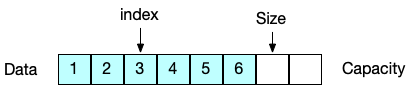
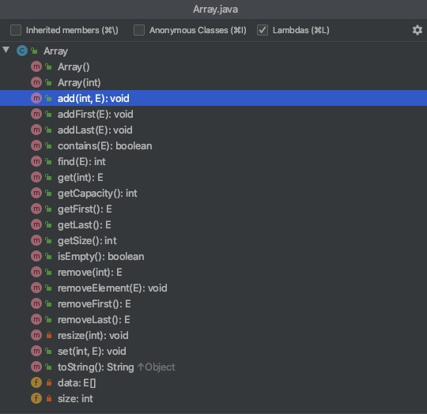
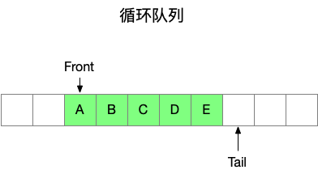
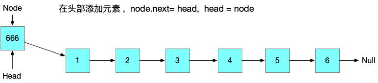
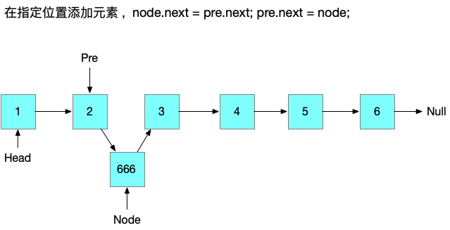
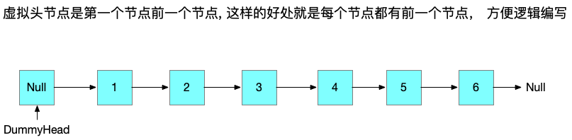
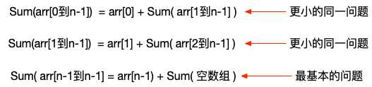

# 玩转数据结构

## Questions

#### 学习数据结构到底有没有用？

大公司需要， 提升自己的技术上限，底层工具开发需要


#### 如何提问题？

仔细debug 。debug是一个优秀工程师必备技能。

好的问题包括：详细说明哪个地方出了问题？你的思考是怎样的？认为会得到怎么样的结果？可实际得到了什么结果？


## Array







## 时间复杂度分析

O(1) 

O(n)

O(lgn)

O(olgn)

O(n^2)

`O` **描述的是算法的运行时间和输入数据之间的关系**


## 栈

是一种 FILO 的数据结构 

#### 应用场景

1. 撤销功能
2. 系统栈
3. 括号匹配:  是{[(时压入栈，是)]}弹栈并比较


## 队列

### 数组队列

入队  addLast() 

出队 removeFirst() 时间复杂度 O(n)


### 循环队列

> 循环队列主要是为了解决 数组队列 出队效率低的问题

通过 front 和 tail 分别指向队列的头和尾部

入队时向后移动 tail 

出队时向后移动 front



为什么叫循环队列呢？意思就是tail 移动到数组的尾部时，如果数组的前面还有位置时，会移动到头部, 会循环起来

#### 关键概念

front ==  tail 时 队列为空

(tail +1) % data.length == front 队列满了 (也就是说有意识的浪费一个空间，因为不想 front == tail 有两个含义，即表示队列为空又表示队列满了)

##### Resize 操作

通过将原来的元素按照顺序放入到新的数组中，值得指出的是，在新的数组中第一个元素是从 0开始的，不管原来的数组的 front 在什么位置

这样便于理解。对于我来说是容易理解的。 且重置  front 和 tail 的值

```java
 private void resize(int newCapacity) {
   Object[] newData = new Object[newCapacity + 1];

   // 将原来的元素重新拿出来，放入新的数组，新的数组，从0开始
   for (int i = 0; i < size; i++)
     newData[i] = data[(front + i) % data.length];

   front = 0;
   tail = size;
   data = newData;
 }
```


##### 另外一种遍历循环队列的方式

从头部的索引 (front) 开始遍历, 每次i向后一个位置 (循环的方式), 只要没有移动到tail，那么就继续循环 

```java
for (int i = front; i != tail; i = (i + 1) % data.length) {
  System.out.print(data[i]);
}
```


## 链表

### 头部添加节点




### 在中间添加元素




### 添加虚拟头节点




## 递归

本质上，将原来的问题，转行为更小的同一问题。

### 例子

利用递归 数组求和





```java
public int sum(int[] arr) {
  return sum(arr, 0);
}

// 求 [leftIndex,arr.length)之间的和
private int sum(int[] arr, int leftIndex) {
  if (leftIndex == arr.length) {
    return 0;
  }
  return arr[leftIndex] + sum(arr, leftIndex + 1);
}
```

如果不理解可以转换成普通的函数调用

### 编写递归逻辑的要领

1. 求解最基本的问题 (递归终止的条件)
2. 把原问题转换成更小的同一问题
3. 注意递归函数的宏观语义
4. 递归函数就是一个函数，完成一个功能


## 树 Tree

### 二叉树

#### 前，中，后 序遍历


### 深度优先遍历

### 广度优先遍历

