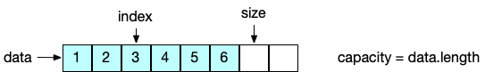
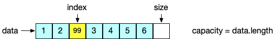
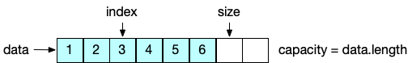

# 如何实现属于自己的动态数组类？

首先对于这个数组类我们应该有哪些要求呢？

1. 必须要能存储任意类型的元素

   可以使用 `Object[]`

2. 可以存放重复元素

3. 存放的元素是按照放入时的顺序排列的

   数组是一块连续的内存，按照索引顺序遍历，起顺序就和放入时一样

4. 支持动态容量变化，但是用户是无感知的

   Java提供的 数组是静态的，需要写逻辑处理这一块


### 内存结构


### 定义类和成员变量

```java
public class Array<E> {
    private Object[] data;
    private int size;

    public Array() {
        this(10);
    }

    public Array(int capacity) {
        data = new Object[capacity];
        size = 0;
    }

    public int getSize() {
        return size;
    }

    public int getCapacity() {
        return data.length;
    }

    public boolean isEmpty() {
        return size == 0;
    }
}
```

`data` 用来存放具体的数组，`size` 用来维护当前 `Array` 有多少数组。


### 向数组中指定位置添加元素  add(int index, E e )

向数组的指定位置添加元素分为两种情况

1. 向数组尾部添加元素，很简单，直接把 `e` 放到 `size`的位置就可以了 `data[size] =e ;` 
2. 向数组的头或者中间添加元素，需要把待添加位置以及后面的元素往后挪一个位置



假设现在要在 index 位置插入一个元素 99, 那么需要将 index位置的元素 3已经后面的元素后移一位



需要注意的是，`移动元素的时候需要从后往迁移, 要先移动 6, 在移动5 以此类推` , 如果先移动3 的话会覆盖掉4, 以此类推

代码上来体现就是 

```java
for (int i = size - 1; i >= index; i--)
     data[i + 1] = data[i];
```

这个 `for` 循环非常还理解， 从后往前遍历，每次向后移一位，通过  `data[i+1] = data[i];`实现。


在这里我是使用 `System.arraycopy()`来实现的。不用管底层是怎么实现的。

看这个方法的语义 `将 src 以 srcPos 索引开始的元素 拷贝到 dest以destPos索引开始的位置， 拷贝 length个元素`

```java
public static native void arraycopy(Object src,  int  srcPos,
                                    Object dest, int destPos,
                                    int length);
```

在这里  `src` 和 `dest` 都是  `data`, 所以在这里的意思就是把 `data index开始的位置移动到 data index+1的位置, 移动的长度为 size-index` 至于为什么要移动 `size-index`长度，我们可以计算一下



这是移动前的状态,  此时 `index = 2 , size=6`, 此时需要移动的元素有 ` 3,4,5,6` 4个元素, 也就是 `size-index`

```java
public void add(int index, E e) {
    if (index < 0 || index > size)
        throw new IllegalArgumentException("Add failed. index required >=0 and <size.");

    if (size >= data.length)
        resize(data.length * 2);


    // for (int i = size - 1; i >= index; i--)
    //     data[i + 1] = data[i];

    if (size - index >= 0)
        System.arraycopy(data, index, data, index + 1, size - index);

    data[index] = e;
    size++;
}

// resize
private void resize(int newCapacity) {
   if (size >= 0)
     data = Arrays.copyOf(data, newCapacity);
}
```

向数组中添加元素，需要检查 `index` 不能小于0 ，不能` > size` , 不能小于0 很好理解，不能 `>size`怎么说呢？ 

当我们初始一个数组时， 如果没有传入 `capacity` 时， 默认给10 个 `capacity` ， 这时会开辟一个 10 个空间的数组

此时的 `size ==0` ，如果向 index 为 1的位置添加元素， 那么 `index 为0` 的位置就被跳过了，相当于浪费了这个空间。

我们再来看另一种特殊的情况，第一次我们开辟了 10 个大小的数组空间，不断添加元素后，此时已经添加了10个元素了，这时要插入第 11个元素， 此时的数组已经容纳不了这么多元素了，而且Java自带的数组是不能自动扩容的，此时就需要触发  `resize(data.length *2)`操作。

`resize` 操作就是将 原来数组中的数组，拷贝到新的数组中 ，并将 `data 指向这个新的数组`, 这个新的数组的容量是原来的 两倍。

#### 那么为了是原来的两倍呢? 为什么不是 `+ 10` 或者 `+1000`

因为取一个常数是不合理的， 比如此时的容量是 10000 ，如果你下次扩容， 只 +10 那么很快，又会继续扩容，这样会频繁出发扩容

那 `+1000` 呢，如果次数只需要存储 20 个元素， 你扩容，一下子从 10 扩容到 10+1000 ，会导致大量空间被浪费。

最后说道 `data.length *2 ` ，比如10 ，扩容后就是 20, 比如 10000 扩容后就是 20000, 两倍的好处， 扩容后的数量跟原来的数量是在一个`级别上`的。像Java 自带的 `ArrayList` 其扩容机制是 `1.5 ` 倍, 其实是一样的，都是让扩容后的容量和之前的容量在一个数量级别上。


#### add和 resize中 可以看到我没有用 for 循环，而是使用了Java 自带的函数

其实用for 循环也是可以的， 不过 for 循环会对每一个元素都访问一遍。

而使用 `System.arraycopy` 或者 `Arrays.copyOf` 相当于对内存做移动，而且是 `native`方法，效率是比 `for` 循环是更好的。


有了 `add(int index, E e )`方法后，其他添加元素的方法完全可以复用它

#### 向数组的头添加元素

`add(0, e);`

#### 向数组的尾部添加元素

`add(size-1, e);


### 从数组中删除元素 remove(int index)

分为两种情况，一种是 删除 数组尾部的元素， 很简单，只需要将 `size-- ;  data[size] =null`即可

第二种情况是从头部或者数组中间删除元素， 这时需要将要删除元素的索引后面的元素向前移一位

```java
for (int i = index + 1; i < size; i++)
  data[i - 1] = data[i];
```

 循环的语义是从 `index+1`位置遍历到 size的前一个位置，将这一段的元素前移一位

我用的是 `System.arraycopy(data, index + 1, data, index, size - (index + 1));`  

`Systemp.arraycopy()` 我在添加元素那一节已经详细介绍过了， `System.arraycopy(data, index + 1, data, index, size - (index + 1));`的语义就是将 `data index+1` 开始 拷贝到 `data index`位置, 拷贝的长度为 ` size- (index+1)`，那为什么是 `size-(index+1)`呢？


假设我们要删除的元素是 `index`的位置也就是元素 3, 此时需要将 `4,5,6`前移一位，也就是要移动3个元素， `size =6 , index=2`

`4-(2+1) =3` 所以拷贝的长度为 `size-(index+1)`

```java
public E remove(int index) {
    if (isEmpty())
        throw new IllegalArgumentException("Remove failed. The array is empty");

    if (index < 0 || index >= size)
        throw new IllegalArgumentException("Remove Failed. The index required >=0 and < size.");

    @SuppressWarnings("unchecked") E ret = (E) data[index];

    // for (int i = index + 1; i < size; i++)
    //     data[i - 1] = data[i];

    if (size - (index + 1) >= 0)
        System.arraycopy(data, index + 1, data, index, size - (index + 1));

    size--;
    data[size] = null;

    if (data.length / 4 == size && data.length / 2 != 0)
        resize(data.length / 2);

    return ret;
}
```

值得注意的是，`当元素个数 == 整个数组长度的四分之一时，触发缩容，缩容成整个数组容量的一半` 为什么要这么做呢？

我们假设一个场景，如果我们不这么做，而是采用

```java
if (data.length / 2 == size)
  resize(data.length / 2);
```

```java
Array<Integer> arr = new Array<>(10);
for (int i = 0; i <10; i++) {
    arr.addLast(i);
}
arr.add(2, 100);
arr.remove(2);
arr.addLast(200);
arr.removeFirst();
```

首先创建一个容量为 10的数组，通过 `for`循环添加10个元素，此时的 `capacity = 10`, 再添加一个元素 100 ,此时触发扩容， `capacity=20`，此时调用 `arr.remove(2)` ，此时 `size==10 是20的一半` 会触发缩容，又添加元素，又扩容，又删除元素又缩容。。。

这样会频繁的触发扩容、缩容操作。

而采用

```java
if (data.length / 4 == size && data.length / 2 != 0)
  resize(data.length / 2);
```

只有等 `size 是 data.lenght` 的四分之一才触发缩容。这种 `lazy`的做法无疑可以获得更好的性能。


---


完整代码 [https://github.com/xiaozefeng/data-structures/blob/master/src/main/java/org/mickey/data/structure/array/Array.java](https://github.com/xiaozefeng/data-structures/blob/master/src/main/java/org/mickey/data/structure/array/Array.java)


