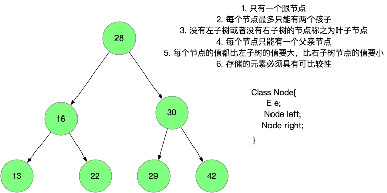

# 二分搜索树 Binary Search Tree



### 二分搜索树有什么优势呢？

当前节点的值比 `左子树` 中节点的值要大， 比右子树中节点的值要小， 那么查找值就很方便了，通过比对当前节点和要查找数据的值，可以判断是在左子树还是右子树， 比起线性数据结构来说，是可以减少查询的次数的。

在上面的二分搜索树中，比如我想查找 值为 16的元素， 首先我找到根节点 28，发现 16比 28 要小， 直接去28 的左子树找就可以了，完全可以不用访问 28 的右子树。


### 定义二分搜索树的结构

```java
// 由于二分搜索树中的元素必须具有可比较性，必须限定泛型的边界
public class BST<E extends Comparable<E>> {

    private class Node {
        public E e;
        public Node left, right;

        public Node(E e) {
            this.e = e;
        }

       // dengbu时用到 , 其实这里可以只打印 元素 e的值，通过 left 和 right 来查看
      // 不过这样可以更直观的看到全部元素，跟人习惯.
        @Override
        public String toString() {
            StringBuilder sb = new StringBuilder();
            inOrder(this, e -> sb.append(e).append("->"));
            return sb.toString();
        }

    }

    // 根节点
    private Node root;
    private int size;

}
```


### 向二分搜索树中添加元素

如果此时二分搜索树为空，那么第一个插入的元素应该作为根节点

如果此时已经有了根节点，那么需要将要插入的元素跟 根元素比较，如果 `e.compareTo(node.e) < 0` 那么需要将 元素 `e` 插入到 root 的左子树，

如果 e.compareTo(node.e ) >0 那么需要将元素 `e` 插入到 root 的 右子树中。

如果此时的树是这样的， 我想将 22 插入到二分搜索树中


大概的过程是这样的，将 22 与根节点28比较，22 比28小， 于是看 28的左孩子 16 ,  22比 16 要大， 那么看 16 的右孩子， 16的右孩子等于 `NULL`

那么就将 22 放到 16的有孩子上， 这个查找的过程是递归的。

我们看看具体的代码

```java
public void add(E e) {
    root = add(root, e);
}

// 向以 node 为根的二分搜索树中插入元素e，递归算法
// 返回插入新节点后二分搜索树的跟
private Node add(Node node, E e) {
  
   //递归终止条件
    if (node == null) {
        size++;
        return new Node(e);
    }

    // 如果e小于节点的值，向左子树中添加元素，并将添加后的二分搜索树的根作为当前节点的左子树连接起来
    if (e.compareTo(node.e) < 0) {
        node.left = add(node.left, e);
    // 如果e大于节点的值，向右子树中添加元素，并将添加后的二分搜索树的根作为当前节点的右子树连接起来
    } else if (e.compareTo(node.e) > 0)
        node.right = add(node.right, e);

   // 返回添加元素后二分搜索树的节点的根
    return node;
}
```

添加操作的 `递归终止条件` 只有一个 ，那就是 `node == null` , 怎么理解这个条件呢？

第一种情况，二分搜索树整个为空，也就是还没有添加任何元素的时候， 此时 root 也为空。那么直接  `new Node(e)` 返回回去作为作为 root 

第二种情况，二分搜索树已经有 `root` 节点了，那么会拿要添加的元素e 跟 node.e 去比较， 如果 `e.compareTo(node.e) < 0` 那么继续到当前节点的左子树中去比较；同理 ，如果 `e.compareTo(node.e) > 0` ，那么继续去当前节点的右子树中比较。

最终, `node.left 或者 node.right  == null` 了， 也就是递归的终止节点，这个时候会 `new Node(e)` 返回， 细节来了， 这个时候通过 

` node.left = add(node.left, e);` 或者 ` node.right = add(node.right, e);` 这个语句，将返回的节点与之前的节点挂接起来了。

对于 `add(Node node, E e )`的理解可以从宏观语义上去理解，这个函数就是 以 node作为根，插入元素e ,然后返回，插入元素后的树的根节点。

代码虽然少，但是要充分理解，是怎么把元素添加进去，并跟已有的二分搜索树连接起来的，需要代码多断点看看。


### 查询二分搜索树中是否包含某元素

查询的思路很简单，如果小于当前节点值，就从左子树中查找，如果大于节点的值，就从右子树中找，如果等于 返回true， 这个过程是递归的。

```java
public boolean contains(E e) {
    return contains(root, e);
}
// 以node为根节点查询是否存在元素e
public boolean contains(Node node, E e) {
    if (node == null) {
        return false;
    }
    if (node.e.compareTo(e) == 0) {
        return true;
      // 元素e 小于 当前节点的值，向左子树中继续查找
    } else if (e.compareTo(node.e) < 0) {
        return contains(node.left, e);
      // 元素e 大于当前节点的值，向右子树中继续查找
    } else {
        return contains(node.right, e);
    }

}
```

递归的终止条件有两个， 如果递归到 `node==null` 说明找不到这个节点，直接返回 `false`

如果递归到，`e.compareTo(node.e) `说明找到了， 返回true， 其他条件就继续在左子树 或 右子树中递归查找。

## 深度优先遍历

### 二分搜索树的前序遍历

先访问当前节点, 再访问左孩子, 再访问右孩子


```java
 private void preOrder(Node root, Consumer<E> c) {
   if (root == null) {
     return;
   }
   c.accept(root.e);
   preOrder(root.left, c);
   preOrder(root.right, c);
 }
```

在这里我用了 `Consumer ` 接口， 这个接口属于函数式编程接口 ，用这个接口有什么好处呢? 

可以让调用者做更多的事情，如在 `toString`中

```java
@Override
public String toString() {
    StringBuilder sb = new StringBuilder();
    sb.append("BST size:").append(size).append("\n");
    sb.append("pre order ");
    // lambda
    preOrder(root, (e) -> {
        sb.append(e).append("->");
    });
    return sb.toString();
}
```

这里通过 lambda 表达式，可以自定 `accept `方法要做的事 比如可以做求和， 统计元素个数

#### 前序遍历的另一种方式

这种方式是非递归的一种时间，而且需要利用 `Stack` 这种数据结构

```java
public void preOrderNR(Consumer<E> c) {
    Stack<Node> stack = new Stack<>();
    stack.push(root);
    while (!stack.isEmpty()) {
        final Node cur = stack.pop();
        if (cur == null) {
            continue;
        }
			  c.accept(cur.e);
        if (cur.right != null) {
            stack.push(cur.right);
        }
        if (cur.left != null) {
            stack.push(cur.left);
        }
    }
}
```

1. 首先把 root 添加到栈中
2. 遍历stack ，只要stack 不为空就一直循环
3. 拿出栈顶元素，如果右孩子不为空，访问栈中，如果左孩子不为空，放入栈中

先放右孩子还是先放左孩子是有讲究的，因为前序遍历是先访问左孩子，再访问右孩子，但是由于栈是 `FILO`的，所以先把右孩子压入栈。

### 二分搜索树的中序遍历

先访问左孩子, 再访问当前节点 , 在访问右孩子

可以发现的是，中序遍历出来的元素是有序的，按照从小到大的顺序排列


中序遍历的代码是类似的

```java
private void inOrder(Node root, Consumer<E> c) {
    if (root == null) {
        return;
    }
    inOrder(root.left, c);
    c.accept(root.e);
    inOrder(root.right, c);
}
```

### 二分搜索树的后序遍历


```java
private void postOrder(Node root, Consumer<E> c) {
    if (root == null) {
        return;
    }
    postOrder(root.left, c);
    postOrder(root.right, c);
    c.accept(root.e);
}
```


### 层序遍历 (广度优先遍历)

每一个节点都有一个深度，比如 root 的深度为 0 

16  和 30 的深度为1 

层序遍历的意思就是按照这个深度一层一层遍历下去


```java
public void levelOrder(Consumer<E> c) {
    LinkedList<Node> queue = new LinkedList<>();
    queue.addLast(root);
    while (!queue.isEmpty()) {
        final Node cur = queue.removeFirst();
        c.accept(cur.e);
        if (cur.left != null)
            queue.addLast(cur.left);
        if (cur.right != null)
            queue.addLast(cur.right);
    }
}
```

层序遍历需要借助`队列`这种数据结构辅助才能完成

1. 首先将`root`添加到 队列中
2. 循环整个队列，只要队列不为空
3. 取出队列的头节点，如果这个节点的左孩子不为空，就添加到队列中，如果这个节点的右孩子不为空，就添加到队列中

首先 将 28加入队列， 然后28的左孩子16加入队列， 然后将28的右孩子30 加入 队列

此时移除头节点 16 ， 发现16有左孩子 13 ，加入队列， 有右孩子 22 ，加入队列

再次循环，移除头节点 30，发现有 左孩子29 ，右孩子42， 分别加入队列

再依次移除头节点 ，这样就完成了层序遍历


### 二分搜索树删除元素

#### 找到二分搜索树的最小值

> 查询二分搜索树的最小值，只要递归的往 `node.left` 找就行，直到  `node.left == null` ,那么 `node` 就是最小的元素

```java
public E minimum() {
    if (isEmpty()) 
        throw new IllegalArgumentException("The BST isEmpty!");
    
    return minimum(root).e;
}

private Node minimum(Node node) {
    if (node.left == null) 
        return node;
    
    return minimum(node.left);
}
```

#### 删除二分搜索树最小值

> 删除而分搜索数的最小值，也是往 `node.left` 递归的找，直到 `node.left==null` , `node` 就是最小值
>
> 值得注意的是，要删除的最小元素如果有右子树，那么需要将右子树返回， 作为上一个节点的左子树, 这样被删除的元素就被绕过了 (删除了)。

```java
public E removeMinimum() {
    final E ret = minimum();
    root = removeMinimum(root);
    return ret;
}
// 以node为根节点，删除最大值，递归算法，返回删除最小值后的二分搜索树的根节点
private Node removeMinimum(Node node) {
    if (node.left == null) {
        Node rightNode = node.right;
        node.right = null;
        size--;
        return rightNode;
    }
  // 用 node.left 接住删除最小值后的二分搜索树的根节点
    node.left = removeMinimum(node.left);
    return node;
}
```


**找到二分搜索树最大值 和 删除二分搜索树的最大值 跟 最小值的思路是一样的。这里仅仅贴一下代码，就不做分析了**

#### 找到二分搜索树最大值

```java
public E maximum() {
    if (isEmpty()) {
        throw new IllegalArgumentException("The BST isEmpty!");
    }
    return maximum(root).e;
}
private Node maximum(Node node) {
    if (node.right == null) {
        return node;
    }
    return maximum(node.right);
}
```

#### 删除二分搜索数的最大值

```java
public E removeMaximum() {
    final E ret = maximum();
    root = removeMaximum(root);
    return ret;
}
// 以node为根节点，删除最大值，递归算法，返回删除最大值后的二分搜索树的根节点
private Node removeMaximum(Node node) {
    if (node.right == null) {
        Node leftNode = node.left;
        node.left = null;
        size--;
        return leftNode;
    }
    node.right = removeMaximum(node.right);
    return node;
}
```


#### 删除指定元素

```java
public void remove(E e) {
    if (isEmpty()) 
        throw new IllegalArgumentException("The BST is empty!");
    
    root = remove(root, e);
}

// 以node为根，删除元素e ,递归算法， 返回删除元素e 后二分搜索树的根节点
private Node remove(Node node, E e) {
    if (node == null) {
        return null;
    }
  
    if (e.compareTo(node.e) < 0) {
        node.left = remove(node.left, e);
        return node;
    } else if (e.compareTo(node.e) > 0) {
        node.right = remove(node.right, e);
        return node;
    } else {  // e == node.e
      //左子树为空
        if (node.left == null) {
            Node rightNode = node.right;
            node.right = null;
            size--;
            return rightNode;
        }

      // 右子树为空
        if (node.right == null) {
            Node leftNode = node.left;
            node.left = null;
            size--;
            return leftNode;
        }

        // 左右子树都不为空
        Node successor = minimum(node.right);
        successor.right = removeMinimum(node.right);
        successor.left = node.left;

        node.left = node.right = null;
        return successor;
    }

}
```

当要删除的元素e 小于当前节点的值，在当前节点的左子树中递归尝试删除

当要删除的元素e 大于当前节点的值，在当前节点的右子树中递归删除删除

当要删除的元素e 等于当前节点的值时， 这个元素就是要删除的元素

这个时候如果 当前节点的左子树为空，那么将当前节点的右子树，挂接到上一个节点的右子树

如果当前节点的右子树为空，那么将当前节点的左子树，挂接到上一个节点的左子树

如果当前节点的左右子树都不为空，这种情况下需要从 左子树或者右子树中找一个节点来顶替当前节点的位置


我们以后继为例， ` 29 = minimum(28.right)`

我们拿到 28的后继 `successor` 之后, 把  `successor .right = removeMinimum(28.的右子树)` 这样就将 原来节点的右子树挂接到了 `successor`的右子树上了， `successor.left = node.left` 就将原来节点的左子树也挂接到 `successor`上了


### 待续

#### rank

#### select

#### ceil

##### floor


---

完整代码: [https://github.com/xiaozefeng/data-structures/blob/master/src/main/java/org/mickey/data/structure/tree/BST.java](https://github.com/xiaozefeng/data-structures/blob/master/src/main/java/org/mickey/data/structure/tree/BST.java)