# 堆 (二叉堆)

二叉堆是一颗 `完全二叉树`: 即除了最底层，其他层的节点都被元素填满，且最底层尽可能地从左到右填入。

每个节点总是大于 (或者总是小于) 其后裔节点；根节点是最大元素 (或者最小元素) 

根节点是最大元素的堆叫 `最大堆`, 根节点是最小元素的堆叫 `最小堆`

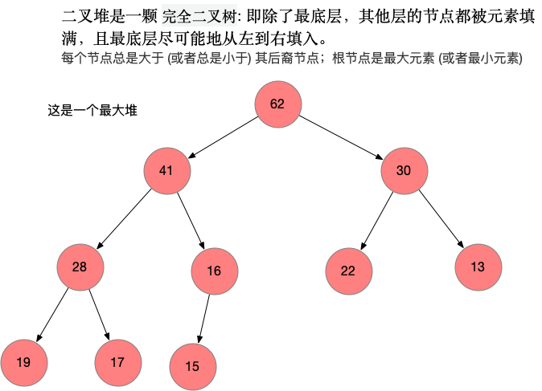

## 用数组存储二叉堆

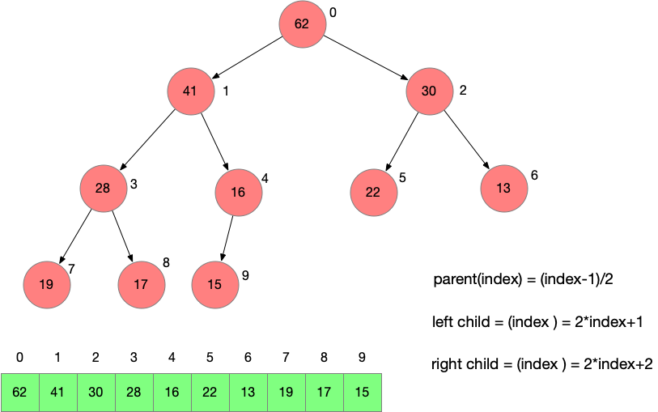


## 二叉堆的基本结构

我们使用 [Array](https://github.com/xiaozefeng/data-structures/blob/master/src/main/java/org/mickey/data/structure/array/Array.java) 这个自定义的数组作为我们的底层数据结构， 方便我们添加想要的方法

```java
public class MaxHeap<E extends Comparable<E>> {
    private Array<E> data;

    public MaxHeap(int capacity) {
        data = new Array<>(capacity);
    }

    public MaxHeap() {
        data = new Array<>();
    }

    public int getSize() {
        return data.getSize();
    }

    public boolean isEmpty() {
        return data.isEmpty();
    }

    private int parent(int index) {
        if (index == 0)
            throw new IllegalArgumentException("Index 0 Can't have parent!");

        return (index - 1) / 2;
    }

    private int leftChild(int index) {
        return index * 2 + 1;
    }

    private int rightChild(int index) {
        return index * 2 + 2;
    }
}
```

我们根据对堆的定义，封装了对 `parent 计算父节点的索引`,  `leftChild, rightChild 计算左右孩子节点的索引`.


## 向二叉堆中添加元素

向堆中添加元素十分简单，因为底层用数组存储数据，直接在数组的末尾添加元素即可， 但是新添加的元素可能会`破坏二叉堆的性质`。

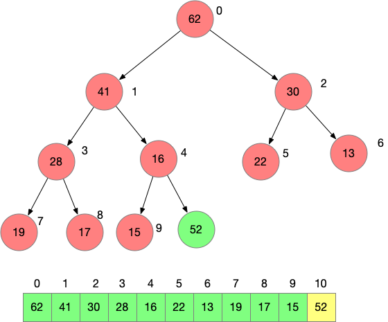

假设次数要添加元素 `52`， 直接在索引为 `10`的位置添加该元素即可，但是次数，并不满足最大堆的性质，比如 52的父亲节点 16是比52小的。

这种情况下，我们就要涉及到 堆的一个重要的操作了，那就是 `siftUp`中文也叫做 `上浮`。


### SiftUp过程

那么siftUp到底是一个什么样的操作呢？

我们发现 52比 16小， 那可以将 52和 16的位置交换, like this

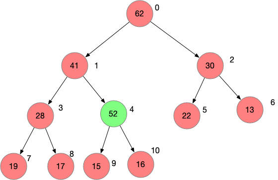

那么此时索引为4的位置就是52了， 索引为10的位置就是16。此时发现 52比它的父亲节点 41还要大，继续 `siftUp`，直到找不到比 52更大的节点。

```java
private void siftUp(int k) {
    while (k > 0 && data.get(parent(k)).compareTo(data.get(k)) < 0) {
        data.swap(k, parent(k));
        k = parent(k);
    }
}


public void add(E e) {
    data.addLast(e);
    siftUp(data.getSize() - 1);
}
```

在代码中体现出来其实就是拿  parent(k) 和 k 不断比较的过程。

最后二叉堆的状态就是这样的

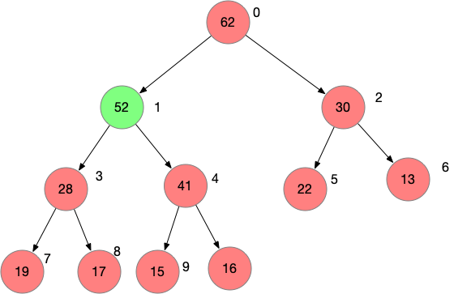


## 从二叉堆中取出最大值

因为我们实现的是一个 `最大堆` 所以最大的元素就是 `根节点`,也就是`索引为0的元素`

但是在数组中删除头节点的话需要将其后面的元素全部前移一位，有一个更好的做法是，将第一个元素与最后一个元素交换位置，然后删除数组最后的元素，那么这个操作的时间复杂度就是 0(1) 了。

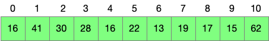

此时 16 在索引为0的位置， 62在 索引为10的位置, 再将数组的最后一个元素删除, 就变成了这样

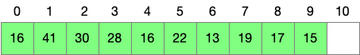

此时树的状态是这样的

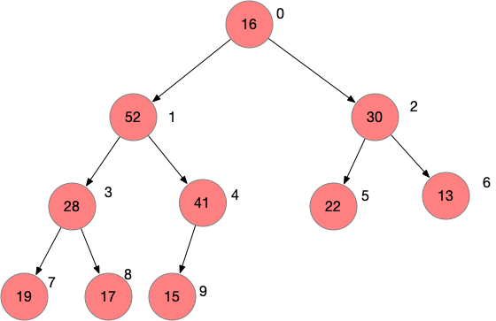

那此时又`不满足二叉堆的性质了`, 跟添加操作类似，此时要做一个操作叫做 `siftDown` 以保持二叉堆的性质；`siftDown` 的中文也叫 下沉。


### SiftDown

就是拿父节点和左右子节点比较，那个节点大，父节点就和哪个节点交换位置。

比如 16 的 左右孩子分别是 52 和 30 , 52比30 大， 所以 16 就和 52交换位置；交换位置后，发现16的两个孩子节点 28 和41 还是比 16大

此时 28 和 41 做比较，41大，16和41交换位置，最后16就来到了索引为4的位置。

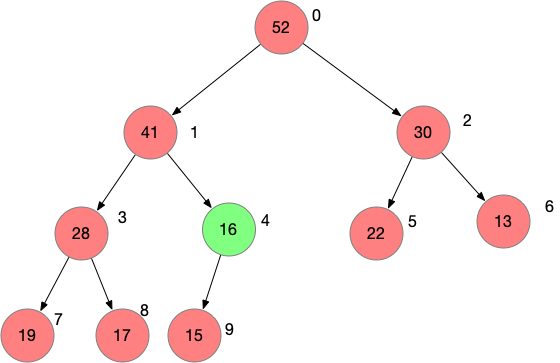

```java
private E findMax() {
    if (isEmpty())
        throw new IllegalArgumentException("Can't find max when heap is empty!");

    return data.getFirst();
}

public E extraMax() {
    E ret = findMax();
    data.swap(0, data.getSize() - 1);
    data.removeLast();
    siftDown(0);
    return ret;
}

private void siftDown(int k) {
    // 左孩子还在size之内, 左孩子没有越界，右孩子也不可能越界
    while (leftChild(k) < data.getSize()) {
        int j = leftChild(k);
        if (j + 1 < data.getSize() && data.get(j + 1).compareTo(data.get(j)) > 0)
            j = rightChild(k);
        //此时 data[j] 是 leftChild 和 rightChild 中的最大值
        // 拿k位置的值和 leftChild, rightChild 中的最大值做比较
        if (data.get(k).compareTo(data.get(j)) >= 0)
            break;

        // 否则交换 k 和 j
        data.swap(k, j);
        k = j;
    }
}
```


## Replace

replace 的过程就是取出堆的最大元素，放入一个新的元素

我们自然而然就可以想到，可以先调用  `extraMax()`取出最大元素，再调用 `add(E e )`方法放入一个元素；不过整个 `replace`方法的时间复杂度就是 `两次O(logn)` 

还有另外一种实现是：可以直接将最大元素替换成要添加的元素，再对这个堆顶的元素做 `SiftDown`操作；这样一来，只有一个 `O(logn)`的操作。

```java
// 取出堆的最大值，再添加元素e
public E replace(E e) {
    E ret = findMax();
    data.set(0, e);
    siftDown(0);
    return ret;
}
```

对应代码中，就是将数组中索引为0的元素替换成新的元素，然后对索引为0的元素做一次 `SiftDown`

## Heapify

`Heapify` 要做的时间其实就是`将任意数组转换成二叉堆`, 很自然的一个想法就是 `将数组中的元素使用 二叉堆的 add方法 一个一个添加到二叉堆中`

这样是可以实现的，不过有一个更快的方式，这个过程通常称之为 `heapify`

我们这里的二叉堆使用数组实现的，那我们可以把数组中的元素直接放到数组中, 比如是这样的

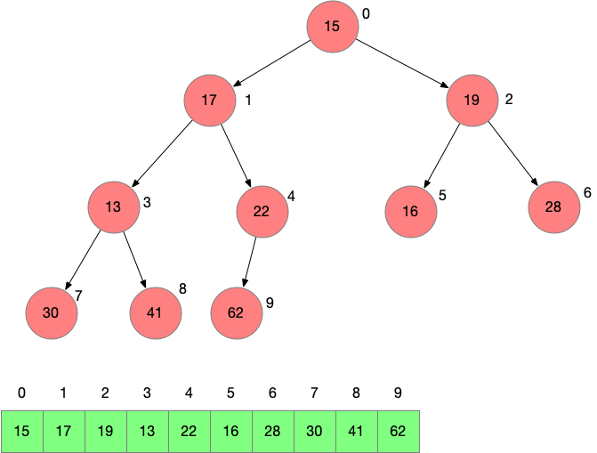

这个数组的元素是 `[15,17,19,13,22,16,28,30,41,62]` ，但是此时的数组是不满足最大堆的性质的；即每个节点的值都大于其孩子节点的值。

所以需要调整元素的位置，让其满足二叉堆的性质。调整方法就是 `找到最后一个非叶子节点，对这个节点以及其前面的节点做 SiftDown()`

### 那么为什么要找到最后一个非叶子节点做 SiftDown 呢？

因为叶子节点没有孩子节点了，不需要做 SiftDown。

### 那么怎么找到最后一个非叶子节点呢？

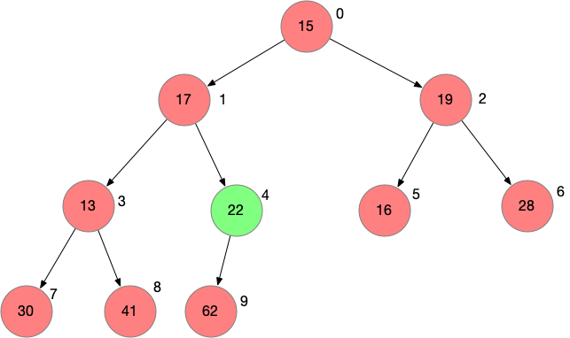

通过上面的图可以看出来，`最后一个节点的父亲节点就是最后一个非叶子节点`, 还记得我们定义过一个 `parent(int index)`方法吗？ 可以通过 `parent(data.getSize() -1)` 就能拿到最后一个非叶子节点的索引

找到这个节点后，对这个节点已经其前面的节点不断做 `SiftDown`, 最后整个数组就满足二叉堆的性质了。


```java
public MaxHeap(E[] arr) {
    if (arr == null || arr.length == 0)
        throw new IllegalArgumentException("arr is null");

    data = new Array<>(arr);
    for (int i = parent(arr.length - 1); i >= 0; i--)
        siftDown(i);
}
```

在代码中，我们通过构造函数来完成 `Heapify`的过程


完整代码: [MaxHeap](https://github.com/xiaozefeng/data-structures/blob/master/src/main/java/org/mickey/data/structure/heap/MaxHeap.java)

对应的数组的源码: [Array](https://github.com/xiaozefeng/data-structures/blob/master/src/main/java/org/mickey/data/structure/array/Array.java)