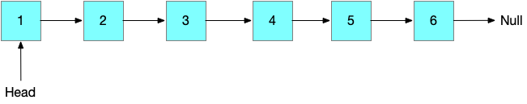
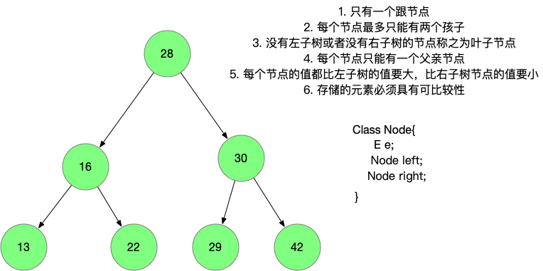

# 底层使用链表和底层使用二分搜索树来实现Set的性能差异

我们知道，链表和二分搜索树都是动态的数据结构，但是链表是一种线性的数据结构，而二分搜索树，顾名思义，就是一个树

#### 链表长这样




每一个节点有一个指向下一个节点的指针

```java
private class Node{
  public E e;
  public Node next;
}
```


#### 二分搜索树长这样



对于二分搜索树, 有一个 left 指针指向节点的左孩子， 有一个right指针指向节点的右孩子, like this:

```java
private class Node{
  public E e;
  public Node left;
  public Node right;
}
```

### 定义Set接口

两者底层数据结构我们知道了，现在来看看实现Set的代码。

首先我们定义一个Set接口, like this

```java
public interface Set<E> {
    void add(E e);
    void remove(E e);
    boolean contains(E e);
    int getSize();
    boolean isEmpty();
}
```


### 链表作为底层

再来看看 链表作为底层的实现代码

```java
public class LinkedListSet<E> implements Set<E> {

    private LinkedList<E> data;

    public LinkedListSet() {
        data = new LinkedList<>();
    }

    @Override
    public void add(E e) {
        if (!data.contains(e))
            data.addFirst(e);
    }

    @Override
    public void remove(E e) {
        data.removeElement(e);
    }

    @Override
    public boolean contains(E e) {
        return data.contains(e);
    }

    @Override
    public int getSize() {
        return data.getSize();
    }

    @Override
    public boolean isEmpty() {
        return data.isEmpty();
    }
}
```

因为 Set 是不存放重复元素的，那么我们需要在添加元素的时候做一下判断，此时的链表是否已经包含了这个元素，如果不包含才添加元素，否则就什么也不做。

值得注意的是，我们在添加元素的时候是调用的 `addFirst(E e)` 这个方法的时间复杂度是 O(1)的，但是由于 `contains(E e)`这个方法需要遍历整个链表，看看不是有这个元素，它的时间复杂度是 `0(n)`的是，所以 `add(E e)` 的整体时间复杂度是 0(n) 的。

并且 `LinkedListSet`的 `remove`方法也是O(n)的负载，因为要想删除元素 `e ` 相当于也需要遍历整个链表。


### 二分搜索树作为底层

现在，我们看看二分搜索树作为底层的Set实现

```java
public class BSTSet<E extends Comparable<E>> implements Set<E> {

    private final BST<E> data;

    public BSTSet() {
        data = new BST<>();
    }

    @Override
    public void add(E e) {
        data.add(e);
    }

    @Override
    public void remove(E e) {
        data.remove(e);
    }

    @Override
    public boolean contains(E e) {
        return data.contains(e);
    }

    @Override
    public int getSize() {
        return data.getSize();
    }

    @Override
    public boolean isEmpty() {
        return data.isEmpty();
    }
}
```

二分搜索树实现的 `Set` 是直接调用 `BST`的相关方法的，`add`方法和 `remove`方法都是直接调用 `BST`的`add`和`remove`

这里可以参考我的另一篇文章 [如何创建属于自己的二分搜索树？](/data-structure/bst)


### 简单的性能测试

```java
@Test
public void testSetTime2(){
    long opCount = 100000;
    Set<Integer> bstSet = new BSTSet<>();
    System.out.println("bst set:"+time2(bstSet, opCount)+ " s");  //bst set:0.134498503 s
    Set<Integer> linkedListSet = new LinkedListSet<>();
    System.out.println("linked list set:" + time2(linkedListSet, opCount) +" s"); // linked list set:21.963827182 s
}

private static double time2(Set<Integer> set, long opCount) {
    long start = System.nanoTime();
    Random random = new Random();
    for (int i = 0; i < opCount; i++)
        set.add(random.nextInt(Integer.MAX_VALUE));

    long end= System.nanoTime();
    return (end - start) / 1000000000.0;
}
```

在我的机器上10w的数据量 bst set 跑了 `0.134498503` s, linked list set 跑了 `21.963827182 s`


---

完整代码:  [https://github.com/xiaozefeng/data-structures/tree/master/src/main/java/org/mickey/data/structure/set](https://github.com/xiaozefeng/data-structures/tree/master/src/main/java/org/mickey/data/structure/set)

测试代码: [https://github.com/xiaozefeng/data-structures/blob/master/src/test/java/org/mickey/data/structure/SetTest.java](https://github.com/xiaozefeng/data-structures/blob/master/src/test/java/org/mickey/data/structure/SetTest.java)