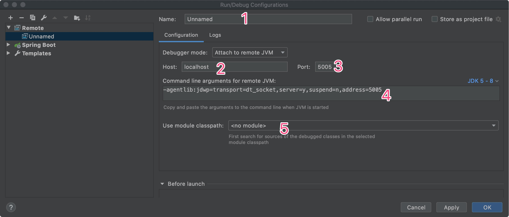
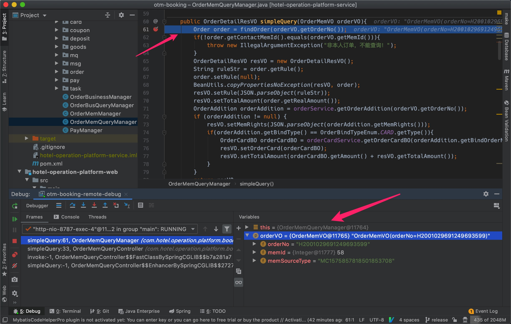

# IntelliJ IDEA 远程debug

### remote 配置

##### edit configuration

##### 添加一个remote



1. 名称，起一个有语义的名称即可

2. debug mode 选择 `Attach to remote JVM`,  填入要debug的服务的ip地址

3. 选择一个端口 

   !>  这个端口必须是服务器开放了可以被访问的端口 

4. 这里会生成一串参数，把这个参数加入到服务器的启动参数中，让远程服务支持debug

5. 选择一个要debug 的模块

   


### 远程服务配置

!> 这个参数需要加到 `-jar`前面

以 `spring boot`为例

```sh
java -agentlib:jdwp=transport=dt_socket,server=y,suspend=n,address=5005 -jar xxx.jar
```


### 开始debug

控制台显示 

`Connected to the target VM, address: 'xxxip:xxx端口', transport: 'socket'`  表示连接成功了




!> 注意不要把参数加到生产 ！